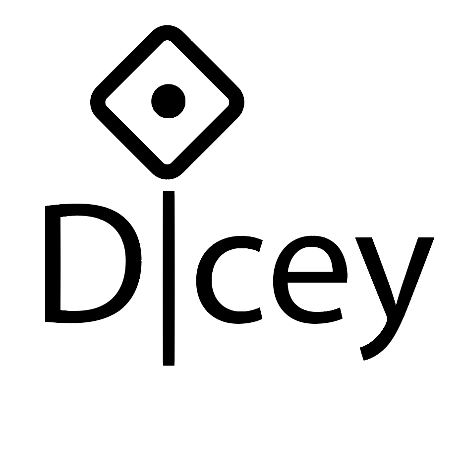

|         |
| ------: |
| 11.1.18 |
|     BWR |
| V.  1.0 |

##*DICEY* a `WillemBarendz` Product			

**Logo ideeen**

**Bespreken Bart**:

* Mijn persoonlijke view is dat: 
  * Er bestaan veel website / apps dus moeten we ons onderscheiden door:
    * Cleane interface is selling point volgens mij. Niet cluttered. Echt ios app *voorbeelden?*
      * Zwart wit, dobbelstenen kleur. 
      * Makkelijker controls. Logisch te bereiken en intuitief. 
      * Research design algemeen en ios. 
    * Uiteindelijke completer aantal features.
    * Grafische interface voor AdX notaties. 
    * Customizen met eigen tekeningen, misschien ook plaatjes uploaden.
    * Bekijk het vanuit een gebruiker. *Dus zelf ook echt gebruiken, vragen vrienden willen gebruiken, dobbelstenen zoek maken :P*

* Hoe gaan we dat doen met verschillende pagina's 
  * Website één overzicht? 
    * Voorbeeld maken met grid in elkaar schuiven, website / app versie
    * Als eigenschappen verschillende classes zijn dan misschien makkelijker veranderen? Of moeten eigenschapen gekoppeld worden aan object?
* Op website eerst link naar app? Of waar moet dat groot staan?
* Uitklap scherm met opties, heb liever fade out veeg van boven, onder, zijkant *maar als het zon uitklap scherm is zelfde kleur maakt misschien niet uit*
* Prototype maken met website grid, werkende dice roll met alleen terminal.
* Bespreken wie wat doet. Wat wil bart doen? Willen we sprints maken ie. binnen tijd iets afmaken. *Misschien later als we dingen hebben*

**Frameworks**

- Grid(CSS)
- Paper.js
- Matter.js
- Cordova, kan ook gelijk android maken *levert geen geld op, snel opgeven wanneer moelijk*
  - Ionicframework
- Javascript
- HTML5
- CSS

**Basale functies**

- 6-zijdige dice
- 1 of meerdere

**Features**

- Animatie
  - Verdeel dice in gooien / niet gooien
  - Selecteer meerdere / minder. Per groep eigenschappen aanpassen
    - Draw circle select multiple
  - Dice stuiteren tegen zijkant, met slepen muis / vinger
  - Binnenste tekens veranderen
    - Wazig
    - Of, punten van de dice hebben zelf physics binnen de borders van de dice
- Aantal zijdes
- Kleuren
  - Color picker
- Symbolen
  - Zelf tekenen
- Sets maken en opslaan
  - Per sessie log bestand opslaan *hoort bij creep?*
- ​

**Feature creep**

- Log bestand, met gegooide getallen etc.
- Dice notatie eg. AdX misschien extend met color eg. AdXc(olor)R(ed)
- Per feature logisch icoontje maken in huisstijl *dikke zwarte randen*
  - Kleur, rgb dobbelstenen stacked
  - Symbolene enge rpg tekens opzoeken, anders gewoon grieks teken? vinger?
  - Wat is voor zijdes logisch?
- Slotje om eigenschappen te lokken / fade out? 
  - **App**
    - Schudden om stenen te gooien
    - Splashscreen met bedrijfsnaam
    - Verschillende schermen voor instellen dice
    - Share? Allemaal dezelfde app, kunnen omste beurt gooien op eigen telefoon. Wow sicke feature dit :P

**AdWare**

* Maximaal aantal throws? Randomizen om irritant te zijn
* Ads in de dobbelstenen zelf om irritant te zijn, gaat pas weg als je erop geklikt hebt
* Banner onderkant van pagina
* Banner na/voor elke throw met cooldown
* Sommige features beperken
  * Layered met website => app. App heeft weer meer gratis functies dan website.
  * App als eenmaal gekocht wel altijd gratis updates. Nieuwe app beginnen is zo gemeen. Gebeurd wel veel. *gaan zien hoe dat zelf gaat als verkoopt en meer geld nodig. Misschien nieuwe codebase.*

**TODO**

* Uitzoeken:
  * Uitzoeken hoe het zit met plagiaat / octrooi.
  * Gebruik van lettertypes.
  * Website runnen op vps of server hosting.
  * Verdienmodellen apps onderzoeken. Monetizen, website?
  * Bedrijf beginnen, kamer van koophandel
    * kosten
    * voordelen
    * hoeveel personen
  * Codebase prive zetten. Gitlab, gitbucket etc.
  * Onderzoek andere dice website, apps